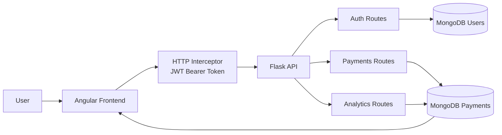
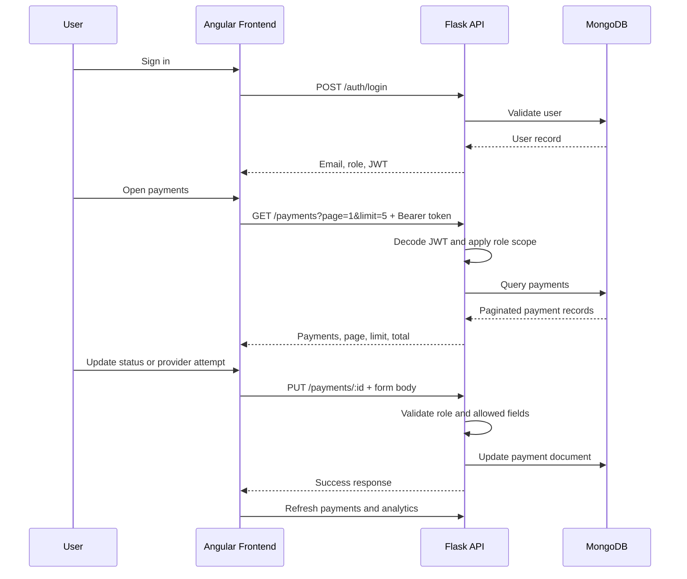

# Payment Routing System


<p align="center">
  <b>Backend-controlled payment routing workflow with provider attempt history, RBAC, and operational analytics</b><br/>
  Angular workspace · Flask API · MongoDB persistence · JWT and role-based access
</p>

<p align="center">
  <a href="#overview"><b>Overview</b></a> ·
  <a href="#architecture"><b>Architecture</b></a> ·
  <a href="./docs/ARCHITECTURE.md"><b>Architecture Notes</b></a> ·
  <a href="#local-development"><b>Local Development</b></a> ·
  <a href="#api-overview"><b>API Overview</b></a>
</p>

## Overview

Payment Routing System is a full-stack operations application for controlled payment lifecycle management. A payment begins as `pending`, can receive recorded provider attempts, and is then moved to `success` or `failed` through role-controlled review. The Angular frontend presents the workflow, but the Flask API remains the authority for authentication, role checks, data scoping, persistence, and mutation rules.

The system is not a generic CRUD table. Each payment document stores merchant ownership, customer details, status, initiated timestamp, and a `provider_attempts` array. That array is the routing history: it records which provider was attempted, whether the attempt succeeded or failed, and the latency observed. This gives finance and administrator users operational evidence rather than only a final status value.

Core capabilities:

- JWT-backed login and merchant registration
- backend-enforced RBAC for admin, finance, and merchant users
- merchant-scoped payment and analytics visibility
- controlled payment creation, status mutation, and provider attempt recording
- provider attempt history for routing and fallback visibility
- search, filtering, sorting, pagination, and row-level detail inspection
- analytics for payment volume, provider latency, and status distribution
- merchant-only account deletion with removal of payments created by that account
- Angular unit and behavioural tests for services, guards, interceptors, and feature workflows

## Why This Project Matters

Payment operations require traceability. Providers can fail, respond slowly, or behave differently by region and currency. A useful workflow therefore needs to show how a transaction moved through providers, who is allowed to act on it, and which records a user is allowed to see.

This implementation demonstrates those concerns through a compact full-stack design:

- `provider_attempts` preserves routing/failover history instead of hiding it behind one final status.
- The backend enforces merchant scoping from JWT identity, so sensitive customer/payment data is not protected only by UI hiding.
- Admin and finance workflows can review global payment data and perform controlled status/provider-attempt operations.
- Merchant users can create and view their own payments, and only merchants can delete their own account.
- Analytics are derived from stored payment records and provider attempts, so charts reflect operational data.
- Frontend state is tested around filtering, sorting, pagination, selected-row synchronisation, and RBAC display logic.

## Suggested Walkthrough

1. Sign in as an administrator and open the dashboard.
2. Review the payments workspace using search, status, region, currency, sorting, and pagination.
3. Select a payment to inspect customer details, status, and provider attempts.
4. Add or review a provider attempt to show routing/fallback history.
5. Sign in as a finance user and demonstrate approve/reject controls.
6. Sign in as a merchant and confirm only merchant-owned payments are visible.
7. Confirm that the account deletion control is merchant-only.
8. Open analytics to review payment volume, provider latency, and status distribution.
9. Run the frontend and backend tests to show behavioural coverage.

## Engineering Challenges

- keeping merchant data isolated while admin and finance users retain global operational visibility
- preserving provider attempt history so routing and fallback behaviour remains auditable
- keeping backend pagination and frontend pagination aligned at 5 payments per page
- combining search, filters, sorting, pagination, and selected-row state without stale UI
- refreshing dashboard and analytics data after payment mutations
- presenting role-specific controls without treating the frontend as the security authority

## Architecture

### System Diagram



The Angular frontend owns the browser workflow: authentication pages, app shell, dashboard, payments workspace, analytics charts, modals, notifications, and role-aware controls. It validates form state and presents only relevant actions, but it does not directly access MongoDB or decide the final data boundary.

The Flask API owns the server-side contract: authentication, JWT validation, role checks, merchant scoping, payment persistence, controlled mutations, pagination, and analytics aggregation.

MongoDB stores users and payment documents. Payment documents contain transaction metadata and the `provider_attempts` array used for routing visibility and provider latency analytics.

More detailed architecture notes live in [docs/ARCHITECTURE.md](./docs/ARCHITECTURE.md).

### Payment Data Model (Actual Structure)

```json
{
  "_id": "65f1c2e9a3b4c5d6e7f89012",
  "merchant": "Stripe Demo Merchant",
  "payment_type": "card_payment",
  "amount_minor": 2599,
  "currency": "GBP",
  "region": "UK",
  "status": "pending",
  "created_by": "merchant@test.com",
  "initiated_at": "2026-04-28T14:30:00.000000",
  "customer_details": {
    "name": "Ava Reed",
    "email": "ava.reed@example.com",
    "country": "UK"
  },
  "provider_attempts": [
    {
      "provider": "Stripe",
      "result": "failure",
      "latency_ms": 310
    },
    {
      "provider": "PayPal",
      "result": "success",
      "latency_ms": 184
    }
  ]
}
```

`provider_attempts` can be empty for a newly created pending payment, or contain multiple ordered entries after provider retries/fallbacks. `customer_details` is embedded so each payment remains self-contained for detail views and operational review.

### User Data Model

```json
{
  "_id": "65f1c2e9a3b4c5d6e7f89045",
  "email": "merchant@test.com",
  "password": "$2b$12$hashedPasswordValue",
  "role": "merchant"
}
```

User passwords are hashed before storage. The `role` value is one of `admin`, `finance`, or `merchant`, and drives RBAC across both Angular routes/UI and Flask endpoint checks.

### Document Design

`customer_details` is embedded inside the payment document to avoid joins when rendering detail panels, filtering records, or reviewing transaction history.

`provider_attempts` is stored as an array because a single payment may move through multiple provider attempts. Each attempt records provider, result, and latency in milliseconds. This models the evidence of routing rather than claiming the system runs an automated provider-selection engine.

Payment `status` is controlled through admin/finance workflows. Merchant users create payments and view merchant-scoped data, but they cannot directly update lifecycle status or provider attempts.

### Routing Strategy (Conceptual)

Routing is represented through the `provider_attempts` array on each payment record. If one provider attempt fails, another provider can be recorded as a retry/fallback attempt on the same payment. The ordered attempts show how the payment moved across providers, while latency values provide a performance signal for analytics.

In a production routing engine, provider selection could be automated using latency, success rate, region, and currency. This submitted version keeps routing manual and transparent: it records the operational history that such an engine would need to audit.

### End-to-End Payment Flow

1. A merchant or administrator creates a payment.
2. The backend stores the payment with `status = pending`.
3. Finance/admin users review the payment.
4. Provider attempts are recorded for Stripe, PayPal, or Adyen.
5. Status is approved/rejected or moved to a final operational state.
6. Analytics aggregate payment volume, provider latency, and status distribution from stored records.

## Request Flow



## Feature Set

### Payment Operations

- searchable payments workspace
- status, region, and currency filtering
- newest/oldest initiated date sorting
- backend-aligned 5-entry pagination
- selected payment detail panel
- create/edit payment modal
- admin-only payment delete confirmation flow
- success/error notifications

### Routing and Provider Attempts

- provider attempt records for Stripe, PayPal, and Adyen
- attempt result tracking with success/failure
- latency capture in milliseconds
- fallback history represented as multiple attempts on one payment
- detail panel visibility for operational review

### Analytics

- payment volume by currency
- provider latency chart
- status distribution chart
- role-scoped analytics for merchants
- refresh after payment mutation

### Authentication and Access

- JWT-backed login
- merchant registration
- session storage
- HTTP interceptor for bearer tokens
- route guards for protected pages
- role-specific controls for admin, finance, and merchant users
- merchant-only account deletion

## Technical Choices

### Provider Attempts as the Routing Record

The system models the operational evidence of routing: each provider attempt stores provider, result, and latency. This keeps the implementation honest while still representing failover and routing history in a way that supports investigation and analytics.

### JWT plus Guards and Interceptor

JWT keeps identity and role claims tied to backend-issued session data. Angular guards improve navigation behaviour, while the interceptor attaches the bearer token consistently. Backend endpoint checks remain the authority for protected data and mutations.

### Signals and Computed State

The payments page uses signals for local state and computed values for derived state. Search, filters, sorting, pagination, and selected payment synchronisation remain predictable because the original API response is not mutated directly.

### Backend Role Scoping

Merchant visibility is enforced by the backend using the JWT email. The frontend also isolates cached payment data by role/email/token so global admin data cannot leak into a merchant session.

## Production Identity Upgrade

The submitted version uses custom JWT authentication issued by the Flask API. Angular stores the active session, attaches the bearer token through the interceptor, and uses guards plus role checks to protect admin, finance, and merchant workflows.

Auth0 is documented as future production scope only. A production version could move hosted login, external identity providers, MFA readiness, token lifecycle management, and tenant-managed users to Auth0 while preserving the same application-level RBAC and merchant-scoping concepts.

The planned migration is documented in [docs/AUTH0_UPGRADE_PLAN.md](./docs/AUTH0_UPGRADE_PLAN.md).

## Project Structure

```text
Payment Routing System/
|-- api/
|   |-- app.py                    Flask entry point and blueprint registration
|   |-- auth.py                   Login, registration, and merchant account deletion
|   |-- payments.py               Payment lifecycle, RBAC queries, analytics endpoints
|   |-- db.py                     MongoDB connection
|   |-- utils.py                  JWT, API response, and role helpers
|   |-- userdata.py               Demo user seeding
|   `-- requirements.txt          Backend dependencies
|-- frontend/
|   |-- angular.json              Angular project configuration
|   |-- package.json              Frontend dependencies and scripts
|   |-- proxy.conf.json           Dev proxy from Angular to Flask
|   `-- src/app/
|       |-- core/                 Services, guards, interceptor, models, constants
|       |-- features/             Auth, dashboard, payments, analytics, unauthorized
|       `-- shared/               App shell, stat cards, empty states, dialogs, theme toggle
`-- docs/
    |-- API_ENDPOINTS.md          API request/response documentation
    |-- APPLICATION_DOCUMENTATION.md
    |-- ARCHITECTURE.md           Deeper system and request-flow notes
    `-- TESTING_SUMMARY.md
```

## Stack

- Angular 21
- TypeScript
- Angular signals and computed state
- Reactive forms
- Angular Router guards
- Angular HTTP interceptor
- RxJS
- Chart.js and ng2-charts
- Vitest / Angular unit testing
- Python
- Flask
- MongoDB / PyMongo
- PyJWT
- bcrypt

## Local Development

### Requirements

- Python 3.11 or newer recommended
- Node.js LTS recommended
- npm
- MongoDB connection available to the Flask API

### Backend

```bash
cd api
pip install -r requirements.txt
python userdata.py
python app.py
```

By default, Flask runs on `http://127.0.0.1:5000`.

### Frontend

```bash
cd frontend
npm install
ng serve
```

Open the Angular app at `http://localhost:4200`.

Angular proxies `/api` requests to Flask through `frontend/proxy.conf.json`.

## Demo Accounts

Seed users are defined in `api/userdata.py`.

| Role | Email | Password | Access |
| --- | --- | --- | --- |
| Admin | `parth@payments.com` | `admin123` | Global operational access and payment deletion |
| Finance | `vishnu@payments.com` | `finance123` | Review, approve/reject, provider attempts, analytics |
| Merchant | `parth@ulster.com` | `parth123` | Own payments only, create payments, delete own account |


## Verification

Run the frontend test suite:

```bash
cd frontend
npm test
```

Build the Angular application:

```bash
cd frontend
ng build
```

Run backend security tests:

```bash
cd api
python -m unittest test_security.py
```

Current automated coverage includes auth, guards, interceptor, payment service behaviour, payment page filtering/sorting/pagination, provider attempts, analytics states, theme service, app bootstrapping, and backend security/RBAC checks.

## API Overview

### Auth Endpoints

| Method | Route | Description |
| --- | --- | --- |
| `POST` | `/api/auth/login` | Authenticate a user and return JWT session data |
| `POST` | `/api/auth/register` | Register a merchant account |
| `DELETE` | `/api/me` | Delete the authenticated merchant account and that account's created payments |

### Payments Endpoints

| Method | Route | Description |
| --- | --- | --- |
| `GET` | `/api/payments?page=1&limit=5` | Retrieve role-scoped, filterable, paginated payments |
| `POST` | `/api/payments` | Initiate a pending payment |
| `PUT` | `/api/payments/:id` | Apply controlled status or provider-attempt lifecycle changes |
| `DELETE` | `/api/payments/:id` | Delete a payment as admin |

### Analytics Endpoints

| Method | Route | Description |
| --- | --- | --- |
| `GET` | `/api/analytics/payment-volume` | Payment volume grouped by currency |
| `GET` | `/api/analytics/provider-latency` | Average latency grouped by provider attempts |
| `GET` | `/api/analytics/payment-status` | Payment count grouped by status |

Full endpoint examples are documented in [docs/API_ENDPOINTS.md](./docs/API_ENDPOINTS.md).

## Tradeoffs

- provider attempts represent routing/failover history, but automated provider selection is not implemented
- analytics focus on operational metrics rather than predictive performance modelling
- session storage is suitable for coursework/demo use but a production deployment would need stricter token lifecycle controls
- the frontend has unit and behavioural coverage for key workflows, but browser-level e2e tests would improve confidence
- the API is intentionally compact because CW2 assesses the Angular frontend while still requiring full-stack boundaries

## Roadmap Ideas

- automated provider selection based on latency and success history
- audit log for status changes and provider attempt additions
- end-to-end browser tests for role workflows
- exportable payment reports for finance users
- advanced analytics for success rate by provider and region
- production deployment notes with environment-specific configuration

## Documentation

- [Architecture Notes](./docs/ARCHITECTURE.md)
- [Auth0 Production Identity Upgrade Plan](./docs/AUTH0_UPGRADE_PLAN.md)
- [API Endpoints](./docs/API_ENDPOINTS.md)
- [Application Documentation](./docs/APPLICATION_DOCUMENTATION.md)
- [Testing Summary](./docs/TESTING_SUMMARY.md)
