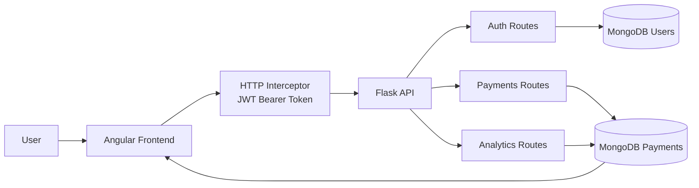
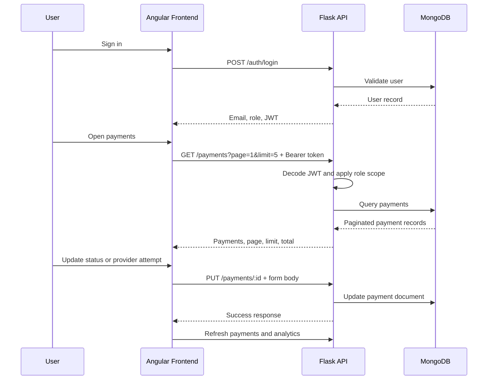

# Payment Routing System


<p align="center">
  <b>Payment orchestration platform for provider attempt tracking, failover visibility, and operational analytics</b><br/>
  Angular workspace · Flask API · MongoDB persistence · JWT and role-based access
</p>

<p align="center">
  <a href="#overview"><b>Overview</b></a> ·
  <a href="#architecture"><b>Architecture</b></a> ·
  <a href="./docs/ARCHITECTURE.md"><b>Architecture Notes</b></a> ·
  <a href="#local-development"><b>Local Development</b></a> ·
  <a href="#api-overview"><b>API Overview</b></a> ·
  <a href="#com661-rubric-alignment"><b>Rubric</b></a>
</p>

## Overview

Payment Routing System is a full-stack fintech operations application built around payment orchestration. It gives merchants, finance users, and administrators a controlled workspace for creating payments, recording provider attempts, reviewing outcomes, and analysing transaction performance.

The project is intentionally more than a CRUD table. A payment record stores its provider attempt history, latency values, customer details, status, merchant ownership, and initiated timestamp. This makes the frontend useful for understanding how a transaction moved through providers and where operational intervention is needed.

Core capabilities:

- JWT-backed login and registration
- role-aware dashboard, payments, and analytics pages
- merchant-scoped payment visibility
- payment creation and status management
- provider attempt history for routing and fallback visibility
- search, filtering, sorting, pagination, and row-level detail inspection
- analytics for payment volume, provider latency, and status distribution
- Angular unit tests for core services, guards, interceptors, and feature behaviour

## Why This Project Matters

Payment platforms depend on reliability. Providers can fail, slow down, or perform differently across regions. A serious operations interface needs to show more than whether a transaction is complete; it needs to show which provider was attempted, whether the attempt succeeded, how long it took, and who is allowed to act on the record.

This project demonstrates those concerns in a focused full-stack application:

- provider attempts make routing history visible instead of hiding it behind one status value
- role-based access protects merchant and customer data
- finance/admin workflows reflect real approval and rejection operations
- analytics are derived from operational payment data rather than static dashboard content
- frontend state is tested around filtering, sorting, pagination, and RBAC behaviour

## Suggested Walkthrough

1. Sign in as an administrator and open the dashboard.
2. Review the payments workspace and use search, status, region, currency, sorting, and pagination.
3. Select a payment to inspect customer details, status, and provider attempts.
4. Add or review a provider attempt to show how failover history is represented.
5. Sign in as a finance user and demonstrate approve/reject controls.
6. Sign in as a merchant and confirm only merchant-owned payments are visible.
7. Open analytics to review payment volume, provider latency, and status distribution.
8. Run the frontend tests to show behavioural coverage.

## Engineering Challenges

- keeping merchant data isolated while allowing admin and finance users to see global payment data
- preserving provider attempt history so fallback behaviour remains auditable
- keeping backend pagination and frontend pagination aligned at 5 payments per page
- combining search, filters, sorting, pagination, and selected-row state without stale UI
- refreshing dashboard and analytics data after payment mutations
- presenting role-specific controls without duplicating business logic across templates

## Architecture

### System Diagram



The Angular frontend owns the browser workflow: authentication pages, app shell, dashboard, payments workspace, analytics charts, modals, notifications, and role-aware controls.

The Flask API owns the server-side contract: authentication, JWT validation, payment persistence, role checks, pagination, and analytics aggregation.

MongoDB stores users and payment documents. Payment documents contain transaction metadata and the `provider_attempts` array used by the frontend for routing visibility and by analytics for latency reporting.

More detailed architecture notes live in [docs/ARCHITECTURE.md](./docs/ARCHITECTURE.md).

### Payment Data Model (Actual Structure)

```json
{
  "_id": "65f1c2e9a3b4c5d6e7f89012",
  "merchant": "Stripe Demo Merchant",
  "payment_type": "card_payment",
  "amount_minor": 2599,
  "currency": "GBP",
  "region": "UK",
  "status": "pending",
  "created_by": "merchant@test.com",
  "initiated_at": "2026-04-28T14:30:00.000000",
  "customer_details": {
    "name": "Ava Reed",
    "email": "ava.reed@example.com",
    "country": "UK"
  },
  "provider_attempts": [
    {
      "provider": "Stripe",
      "result": "failure",
      "latency_ms": 310
    },
    {
      "provider": "PayPal",
      "result": "success",
      "latency_ms": 184
    }
  ]
}
```

`provider_attempts` can be empty for a newly created pending payment, or contain multiple entries when more than one provider has been attempted. `customer_details` is stored as an embedded object on every payment document.

### User Data Model

```json
{
  "_id": "65f1c2e9a3b4c5d6e7f89045",
  "email": "merchant@test.com",
  "password": "$2b$12$hashedPasswordValue",
  "role": "merchant"
}
```

User passwords are hashed before storage. The `role` value is one of `admin`, `finance`, or `merchant`, and drives RBAC across both the Angular frontend and Flask backend.

### Document Design

`customer_details` is embedded inside the payment document to keep each payment self-contained and avoid joins when rendering detail panels, filtering operational records, or reviewing transaction history.

`provider_attempts` is stored as an array because a single payment may move through multiple provider attempts. Each attempt records the provider, result, and latency in milliseconds, which makes routing simulation visible rather than reducing the payment to one final status.

This structure supports retry logic, analytics aggregation, and full payment traceability. Provider attempts represent the routing simulation history, latency values act as a future optimisation signal, and payment `status` is controlled through finance/admin workflows rather than uncontrolled merchant edits.

## Request Flow



## Feature Set

### Payment Operations

- searchable payments workspace
- status, region, and currency filtering
- newest/oldest initiated date sorting
- backend-aligned 5-entry pagination
- selected payment detail panel
- create/edit payment modal
- delete confirmation flow
- success/error notifications

### Routing and Provider Attempts

- provider attempt records for Stripe, PayPal, and Adyen
- attempt result tracking with success/failure
- latency capture in milliseconds
- fallback history represented as multiple attempts on one payment
- detail panel visibility for operational review

### Analytics

- payment volume by currency
- provider latency chart
- status distribution chart
- role-scoped analytics for merchants
- refresh after payment mutation

### Authentication and Access

- JWT-backed login
- merchant registration
- session storage
- HTTP interceptor for bearer tokens
- route guards for protected pages
- role-specific controls for admin, finance, and merchant users

## Technical Choices

### Provider Attempts as the Routing Record

The system does not pretend to run a hidden automated routing engine. Instead, it models the operational evidence of routing: each provider attempt stores provider, result, and latency. This keeps the implementation honest while still representing failover and routing history in a way that supports analytics.

### JWT plus Guards and Interceptor

JWT keeps the backend responsible for identity and role claims. Angular guards protect routes before pages load, while the interceptor attaches the bearer token consistently without each service manually handling auth headers.

### Signals and Computed State

The payments page uses signals for local state and computed values for derived state. Search, filters, sorting, pagination, and selected payment synchronisation are kept predictable because the original payment list is not mutated directly.

### Backend Role Scoping

Merchant visibility is enforced by the backend using the JWT email. The frontend also isolates cached payment data by role/email/token so global admin data cannot leak into a merchant session.

## Production Identity Upgrade

The submitted version uses custom JWT authentication issued by the Flask API. Angular stores the active session, attaches the bearer token through the interceptor, and uses guards plus role checks to protect admin, finance, and merchant workflows.

Auth0 is documented as a future production hardening path only. A production version could move login, external identity providers, MFA readiness, token lifecycle management, and tenant-managed users to Auth0 while preserving the existing RBAC and merchant-scoping concepts.

The planned migration is documented in [docs/AUTH0_UPGRADE_PLAN.md](./docs/AUTH0_UPGRADE_PLAN.md).

## Project Structure

```text
Payment Routing System/
├── api/
│   ├── app.py                    Flask entry point and blueprint registration
│   ├── auth.py                   Login and registration endpoints
│   ├── payments.py               Payment CRUD, RBAC queries, analytics endpoints
│   ├── db.py                     MongoDB connection
│   ├── utils.py                  JWT, API response, and role helpers
│   ├── userdata.py               Demo user seeding
│   └── requirements.txt          Backend dependencies
├── frontend/
│   ├── angular.json              Angular project configuration
│   ├── package.json              Frontend dependencies and scripts
│   ├── proxy.conf.json           Dev proxy from Angular to Flask
│   └── src/app/
│       ├── core/                 Services, guards, interceptor, models, constants
│       ├── features/             Auth, dashboard, payments, analytics, unauthorized
│       └── shared/               App shell, stat cards, empty states, dialogs, theme toggle
└── docs/
    ├── API_ENDPOINTS.md          API request/response documentation
    ├── APPLICATION_DOCUMENTATION.md
    ├── ARCHITECTURE.md           Deeper system and request-flow notes
    └── TESTING_SUMMARY.md
```

## Stack

- Angular 21
- TypeScript
- Angular signals and computed state
- Reactive forms
- Angular Router guards
- Angular HTTP interceptor
- RxJS
- Chart.js and ng2-charts
- Vitest / Angular unit testing
- Python
- Flask
- MongoDB / PyMongo
- PyJWT
- bcrypt

## Local Development

### Requirements

- Python 3.11 or newer recommended
- Node.js LTS recommended
- npm
- MongoDB connection available to the Flask API

### Backend

```bash
cd api
pip install -r requirements.txt
python userdata.py
python app.py
```

By default, Flask runs on `http://127.0.0.1:5000`.

### Frontend

```bash
cd frontend
npm install
ng serve
```

Open the Angular app at `http://localhost:4200`.

Angular proxies `/api` requests to Flask through `frontend/proxy.conf.json`.

## Demo Accounts

Seed users are defined in `api/userdata.py`.

| Role | Email | Password | Access |
| --- | --- | --- | --- |
| Admin | `parth@payments.com` | `admin123` | Full operational access |
| Finance | `vishnu@payments.com` | `finance123` | Review, approve/reject, analytics |
| Merchant | `arjun@payments.com` | `pass123` | Own payments only, create payments |
| Merchant | `honey@payments.com` | `pass123` | Own payments only, create payments |

## Verification

Run the frontend test suite:

```bash
cd frontend
npm test
```

Build the Angular application:

```bash
cd frontend
ng build
```

Current automated coverage includes auth, guards, interceptor, payment service behaviour, payment page filtering/sorting/pagination, provider attempts, analytics states, theme service, and app bootstrapping.

## API Overview

### Auth Endpoints

| Method | Route | Description |
| --- | --- | --- |
| `POST` | `/api/auth/login` | Authenticate a user and return JWT session data |
| `POST` | `/api/auth/register` | Register a merchant account |

### Payments Endpoints

| Method | Route | Description |
| --- | --- | --- |
| `GET` | `/api/payments?page=1&limit=5` | Retrieve role-scoped paginated payments |
| `POST` | `/api/payments` | Create a new payment |
| `PUT` | `/api/payments/:id` | Update payment status or append provider attempts |
| `DELETE` | `/api/payments/:id` | Delete a payment as admin |

### Analytics Endpoints

| Method | Route | Description |
| --- | --- | --- |
| `GET` | `/api/analytics/payment-volume` | Payment volume grouped by currency |
| `GET` | `/api/analytics/provider-latency` | Average latency grouped by provider |
| `GET` | `/api/analytics/payment-status` | Payment count grouped by status |

Full endpoint examples are documented in [docs/API_ENDPOINTS.md](./docs/API_ENDPOINTS.md).

## Tradeoffs

- provider attempts represent routing/failover history, but automated provider selection is not implemented
- analytics focus on operational metrics rather than predictive performance modelling
- session storage is suitable for coursework/demo use but a production deployment would need stricter token lifecycle controls
- the frontend has unit coverage for key behaviours, but browser-level e2e tests would improve confidence
- the API is intentionally compact because CW2 assesses the Angular frontend

## Roadmap Ideas

- automated provider selection based on latency and success history
- audit log for status changes and provider attempt additions
- end-to-end browser tests for role workflows
- exportable payment reports for finance users
- advanced analytics for success rate by provider and region
- production deployment notes with environment-specific configuration

## COM661 Rubric Alignment

| Criterion | Evidence |
| --- | --- |
| Use of Angular | Standalone components, signals, computed state, reactive forms, route guards, interceptor, pipes, inputs/outputs, template control flow, and charts |
| Application Structure | Clear `core`, `features`, and `shared` separation with typed models and reusable components |
| Backend Communication | Authenticated GET, POST, PUT, and DELETE flows with JWT, pagination, role scoping, and analytics endpoints |
| Usability | Search, filters, sorting, pagination, modals, detail panels, notifications, confirmation, loading/error/empty states, responsive auth, and theme support |
| Submission Quality | README, API docs, architecture notes, application documentation, and testing summary are included |

## Documentation

- [Architecture Notes](./docs/ARCHITECTURE.md)
- [Auth0 Production Identity Upgrade Plan](./docs/AUTH0_UPGRADE_PLAN.md)
- [API Endpoints](./docs/API_ENDPOINTS.md)
- [Application Documentation](./docs/APPLICATION_DOCUMENTATION.md)
- [Testing Summary](./docs/TESTING_SUMMARY.md)
