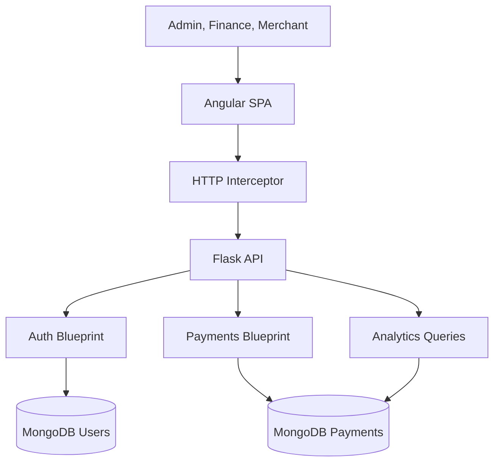
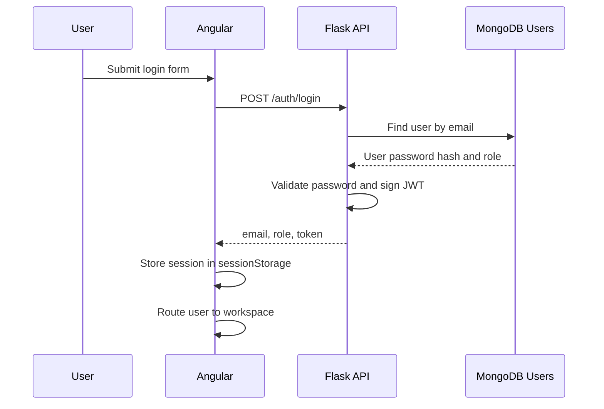
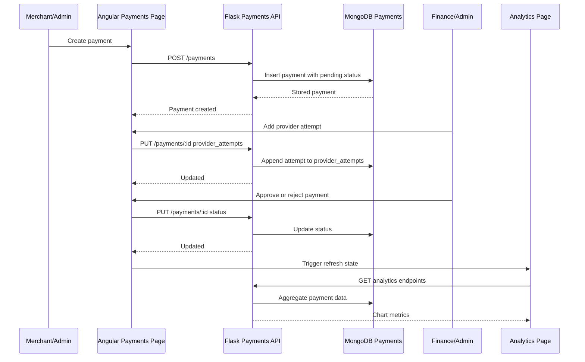

# Payment Routing System Architecture

Payment Routing System is split into an Angular frontend, a Flask API, and MongoDB persistence. The architecture is intentionally small enough for coursework review but structured around real full-stack boundaries: the browser owns interaction, the API owns identity and persistence rules, and the database stores operational payment history.

## System Context



## Frontend Responsibilities

The Angular application is responsible for product workflow and usability.

Key frontend responsibilities:

- render role-aware pages and navigation
- protect private routes through guards
- keep auth state in session storage
- attach JWT tokens through the HTTP interceptor
- present search, filter, sort, and pagination controls
- manage payment selection and detail-panel state
- validate reactive forms before sending API requests
- show loading, empty, error, confirmation, and notification states
- render analytics charts from backend metric endpoints

The frontend is organised into:

| Area | Responsibility |
| --- | --- |
| `core` | API services, guards, interceptor, models, constants |
| `features` | route-level screens: auth, dashboard, payments, analytics |
| `shared` | reusable UI components such as shell, empty state, stat card, dialog, notification banner, theme toggle |

## Backend Responsibilities

The Flask API provides the server contract used by Angular.

Key backend responsibilities:

- register and authenticate users
- issue JWT tokens
- decode JWT identity on protected requests
- enforce role access for payment and analytics endpoints
- scope merchant payment queries by authenticated email
- persist payment records in MongoDB
- return paginated payment responses
- aggregate analytics from stored payment data

The API keeps the frontend from needing direct database knowledge. Angular asks for payments and analytics; Flask decides which records the current user is allowed to access.

## Authentication Flow



After login, the Angular interceptor sends:

```http
Authorization: Bearer <jwt-token>
```

The API decodes the token and attaches the identity to the request context. Protected routes then check whether the role is allowed.

## Role-Based Access

RBAC is applied in both the frontend and backend.

Frontend:

- `authGuard` blocks private pages when no session exists
- `roleGuard` blocks routes when the active role is not allowed
- computed permission checks show/hide actions in the payments workspace

Backend:

- protected endpoints require a valid JWT
- admin and finance users can access global payment data
- merchant users are scoped with `created_by = authenticated_email`

This double layer matters because UI hiding is not security by itself. The backend still owns the real data boundary.

## Payment Lifecycle



## Provider Attempts

`provider_attempts` is the core modelling decision behind the routing story. Instead of storing only a final provider or final result, the payment record stores every attempt that matters operationally.

Example:

```json
[
  {
    "provider": "Stripe",
    "result": "failure",
    "latency_ms": 310
  },
  {
    "provider": "PayPal",
    "result": "success",
    "latency_ms": 184
  }
]
```

This supports:

- fallback visibility
- latency comparison
- operational investigation
- analytics by provider
- clearer status decisions by finance/admin users

The current implementation records and displays provider attempts. It does not claim to automatically choose the best provider in code.

## Pagination Model

The payments API supports `page` and `limit`. The backend default and frontend page size are aligned at 5 entries per page.

```http
GET /api/payments?page=1&limit=5
```

The frontend uses role-scoped payment data, then applies local search, filter, sort, and UI pagination. This gives a responsive table experience while preserving the backend pagination contract.

## Cache Isolation

The payments service caches fetched payment records for efficiency. The cache key includes role, email, and token so a session cannot reuse another user's dataset.

This is especially important for merchant users. If an admin previously loaded global payments, a later merchant session must not see that cached global list.

## Analytics Refresh

Analytics data is derived from the same payment records used by the operations workflow. After a payment mutation, the frontend calls `AnalyticsService.refreshAfterMutation()`. The analytics page observes that refresh signal and reloads volume, latency, and status metrics.

This keeps the dashboard-style views connected to real operational changes.

## Data Boundaries

| Boundary | Owner | Notes |
| --- | --- | --- |
| Form validation | Angular | Prevents invalid user input before API calls |
| Authentication | Flask + Angular | Flask issues JWT; Angular stores and attaches it |
| Authorization | Flask + Angular | Angular controls UX; Flask protects data |
| Persistence | Flask + MongoDB | Angular never writes directly to the database |
| Analytics | Flask + MongoDB | Aggregation is based on stored payments |
| Presentation state | Angular | Signals and computed values drive UI state |

## Current Limitations

- provider attempts are recorded manually through the operations UI
- automated provider scoring/routing is a future enhancement
- analytics are operational summaries rather than predictive models
- session storage is acceptable for coursework/demo use but production would need a stricter token strategy
- full browser end-to-end tests are not currently included

## Future Architecture Improvements

- automatic provider routing based on latency and success rate
- audit trail for every status and provider-attempt change
- server-side activity history for finance/admin review
- e2e tests for admin, finance, and merchant workflows
- deployment documentation with environment variables and MongoDB setup
