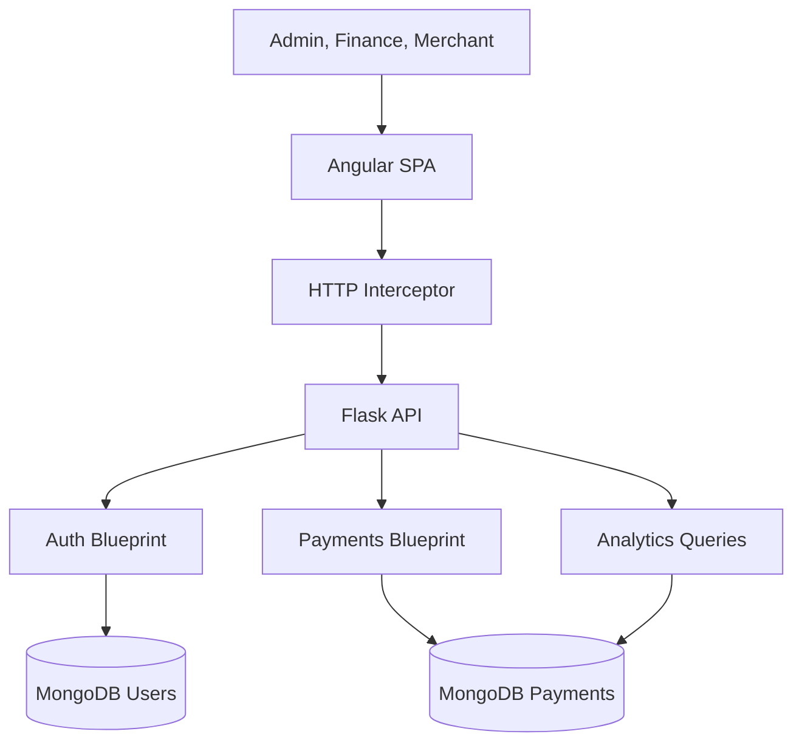
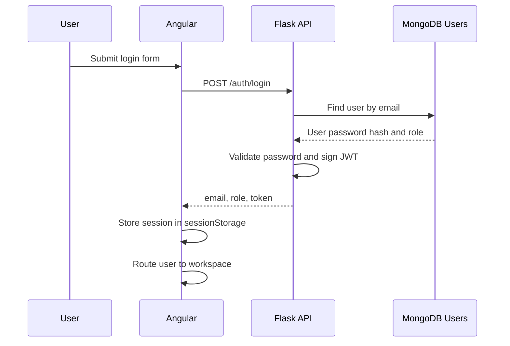
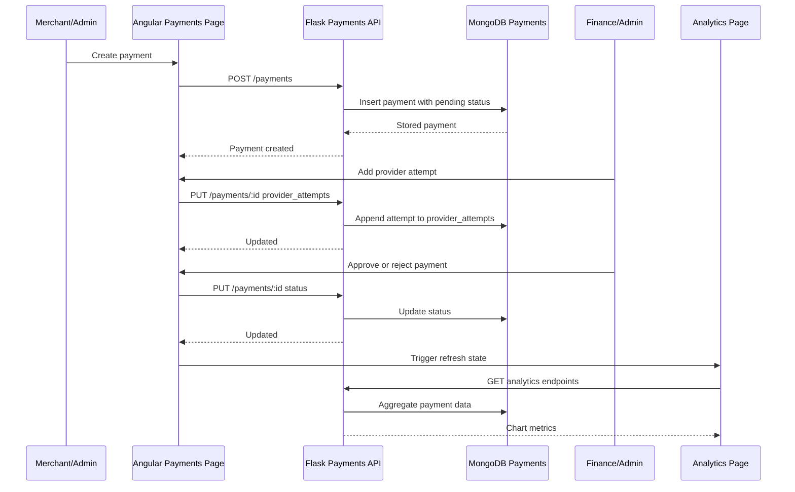
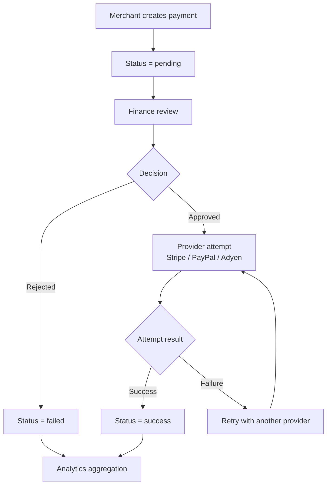

# Payment Routing System Architecture

Payment Routing System is split into an Angular frontend, a Flask API, and MongoDB persistence. The design is deliberately compact, but it keeps real full-stack boundaries: the browser owns interaction, the API owns identity and mutation rules, and MongoDB stores operational payment history.

## System Context



The diagram shows the main control boundary. Angular never reads or writes MongoDB directly. Every protected payment and analytics request passes through Flask, where JWT identity and role permissions are resolved before records are returned or changed.

## Frontend Responsibilities

The Angular application is responsible for workflow presentation and usability:

- render role-aware pages and navigation
- protect private routes through guards
- keep auth state in session storage
- attach JWT tokens through the HTTP interceptor
- present search, filter, sort, and pagination controls
- manage payment selection and detail-panel state
- validate reactive forms before sending API requests
- show loading, empty, error, confirmation, and notification states
- render analytics charts from backend metric endpoints

Frontend organisation:

| Area | Responsibility |
| --- | --- |
| `core` | API services, guards, interceptor, models, constants |
| `features` | route-level screens: auth, dashboard, payments, analytics |
| `shared` | reusable UI such as shell, empty state, stat card, dialog, notification banner, theme toggle |

The frontend hides unavailable actions for clarity, but this is not treated as the security boundary.

## Backend Responsibilities

The Flask API provides the authoritative server contract:

- register and authenticate users
- issue and decode JWT tokens
- enforce role access for payment, analytics, and account endpoints
- scope merchant payment queries by authenticated email
- persist payment records in MongoDB
- set new payments to `pending`
- validate controlled status/provider-attempt mutations
- return paginated payment responses
- aggregate analytics from stored payment data

Angular asks for payments and analytics; Flask decides which records the current user can access and which mutations are allowed.

## Authentication Flow



After login, the Angular interceptor sends:

```http
Authorization: Bearer <jwt-token>
```

The API decodes the token and attaches identity to the request context. Protected routes then check the role before querying or mutating data.

## Role-Based Access

RBAC is applied in both the frontend and backend.

Frontend:

- `authGuard` blocks private pages when no session exists
- `roleGuard` blocks routes when the active role is not allowed
- computed permission checks show/hide actions in the payments workspace and app shell

Backend:

- protected endpoints require a valid JWT
- admin and finance users can access global payment and analytics data
- merchant users are scoped with `created_by = authenticated_email`
- account deletion is merchant-only
- payment deletion is admin-only
- finance updates are limited to review/status/provider-attempt actions

This double layer matters because UI hiding is not security by itself. The backend owns the real data boundary.

## Auth0-ready Boundary

The current application does not implement Auth0. It uses Flask-issued JWTs for the submitted coursework version. The authentication boundary is isolated so a future production identity provider could replace token issuing/validation without rewriting payments, analytics, dashboard, or RBAC screens.

Preserved boundary points:

- `AuthService` owns login, registration, logout, active session state, role, email, token access, and account deletion calls
- route guards use the auth abstraction
- the HTTP interceptor centralises bearer token attachment
- backend token validation resolves identity before protected handlers run
- merchant scoping remains server-side

## Payment Lifecycle



The flow is lifecycle-driven. Creation produces a pending record. Provider attempts add routing evidence. Status updates express the operational outcome. Analytics are refreshed from the same persisted records.

## Provider Attempts

`provider_attempts` is the core modelling decision behind the routing story. Instead of storing only a final provider or final result, the payment record stores every provider attempt that matters operationally.

Example:

```json
[
  {
    "provider": "Stripe",
    "result": "failure",
    "latency_ms": 310
  },
  {
    "provider": "PayPal",
    "result": "success",
    "latency_ms": 184
  }
]
```

This supports:

- fallback visibility
- latency comparison
- operational investigation
- analytics by provider
- clearer status decisions by finance/admin users

The current implementation records and displays provider attempts. It does not claim to automatically choose the best provider in code.

### Payment Routing Decision Flow



This diagram is conceptual: it explains how the recorded attempts support routing visibility. The submitted implementation records attempts manually through the operations UI rather than running an automated routing engine.

## Pagination and Local State

The payments API supports `page` and `limit`. The backend default and frontend page size are aligned at 5 entries per page.

```http
GET /api/payments?page=1&limit=5
```

The frontend uses role-scoped payment data, then applies local search, filter, sort, and UI pagination. Signals and computed values keep the original response intact while deriving the displayed table state.

## Cache Isolation

The payments service caches fetched payment records for efficiency. The cache key includes role, email, and token so a session cannot reuse another user's dataset.

This matters for merchant isolation. If an admin previously loaded global payments, a later merchant session must not see that cached global list.

## Analytics Refresh

Analytics data is derived from the same payment records used by the operations workflow. After a payment mutation, the frontend calls `AnalyticsService.refreshAfterMutation()`. The analytics page observes that refresh signal and reloads volume, latency, and status metrics.

This keeps charts connected to real operational changes rather than static dashboard content.

## Data Boundaries

| Boundary | Owner | Notes |
| --- | --- | --- |
| Form validation | Angular | Prevents invalid user input before API calls |
| Authentication | Flask + Angular | Flask issues JWT; Angular stores and attaches it |
| Authorization | Flask + Angular | Angular controls UX; Flask protects data and mutations |
| Persistence | Flask + MongoDB | Angular never writes directly to the database |
| Payment lifecycle | Flask + MongoDB | Status and provider attempts are updated through protected endpoints |
| Analytics | Flask + MongoDB | Aggregation is based on stored payments |
| Presentation state | Angular | Signals and computed values drive UI state |

## Current Limitations

- provider attempts are recorded manually through the operations UI
- automated provider scoring/routing is a future enhancement
- analytics are operational summaries rather than predictive models
- session storage is acceptable for coursework/demo use but production would need a stricter token strategy
- full browser end-to-end tests are not currently included

## Future Architecture Improvements

- automatic provider routing based on latency and success rate
- audit trail for every status and provider-attempt change
- server-side activity history for finance/admin review
- e2e tests for admin, finance, and merchant workflows
- deployment documentation with environment variables and MongoDB setup
